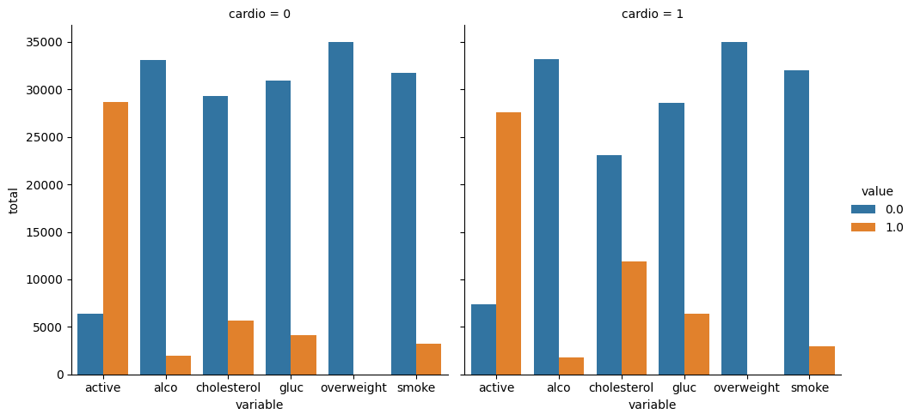
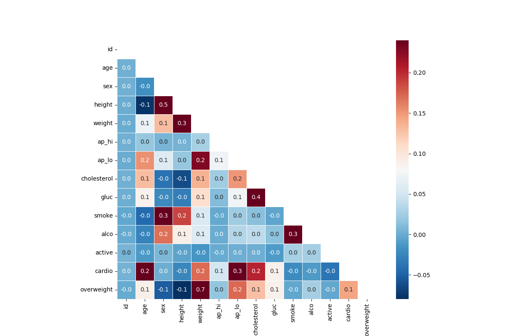

# Medical Data Visualizer

The **Medical Data Visualizer** project is part of the **Data Analysis with Python** certification from [freeCodeCamp](https://www.freecodecamp.org/). This project involves visualizing a medical dataset to explore various relationships and trends between factors like cholesterol, glucose levels, smoking habits, and more, using Python libraries such as Pandas, Seaborn, and Matplotlib.

## Project Overview

The goal of this project is to load, clean, and analyze the data to create meaningful visualizations that can provide insights into cardiovascular health. The project includes two main visualizations:
1. A **Categorical Plot** that shows the distribution of certain features (like cholesterol, glucose levels, smoking habits, etc.) based on the presence or absence of cardiovascular disease.
2. A **Heatmap** that visualizes the correlation between different features of the dataset.

## Libraries Used
- `pandas`: For data manipulation and analysis
- `seaborn`: For data visualization
- `matplotlib`: For additional plotting functionality
- `numpy`: For numerical operations


## Steps in the Project

### 1. Data Cleaning

The dataset undergoes several cleaning steps to ensure that the data is suitable for analysis:
- **Overweight Calculation**: A new column `overweight` is added based on the BMI formula.
- **Normalization of Cholesterol and Glucose Levels**: Cholesterol and glucose columns are simplified to binary values (1 or 0).
- **Removal of Invalid Entries**: Certain rows are filtered based on valid values for attributes like blood pressure, height, and weight.

### 2. Visualization

- **Categorical Plot**: 
  This plot visualizes the distribution of key variables (`cholesterol`, `gluc`, `smoke`, `alco`, `active`, and `overweight`) based on the presence or absence of cardiovascular disease.
  - The `sns.catplot` function is used to create a bar plot that shows the counts of each variable grouped by `cardio` (presence of cardiovascular disease).

- **Heatmap**: 
  This heatmap visualizes the correlation matrix of the dataset, showing how different medical variables relate to each other.
  - The `sns.heatmap` function is used to generate a heatmap of the correlation coefficients.

## Functions

### `draw_cat_plot()`

This function generates and saves a categorical plot (`catplot.png`) to visualize the distribution of key features based on the presence of cardiovascular disease.

### `draw_heat_map()`

This function generates and saves a heatmap (`heatmap.png`) to visualize correlations between different medical attributes in the dataset.

## Usage

1. Install the necessary dependencies:
  ```bash
  pip install -r requirements.txt
2. Run the script to generate the visualizations:
  ```bash
  python medical_data_visualizer.py
3. The script will generate two image files: catplot.png, and heatmap.png

## Project Goals

-  Use Python for data cleaning, analysis, and visualization, providing insights into cardiovascular health.
- The visualizations can help healthcare professionals or researchers identify key trends and relationships between different health indicators.


